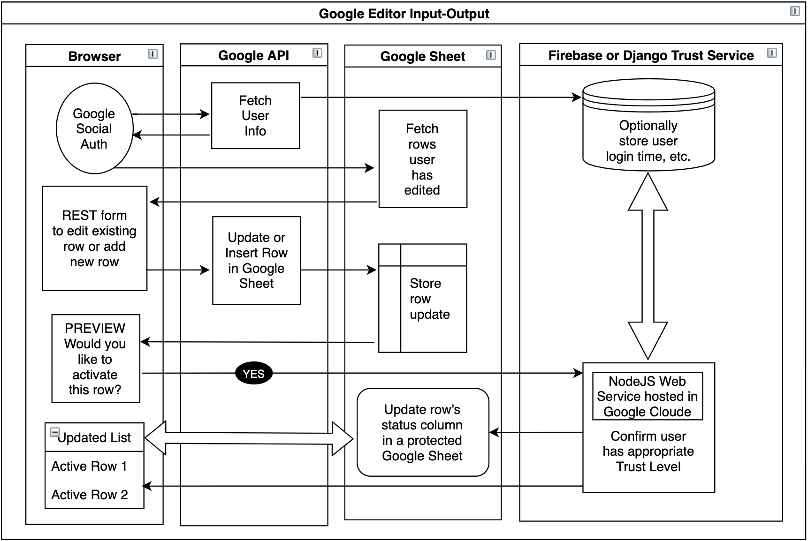

# Google Sheet Editor

Javascript browser-frontend work resides in [Google-OneTap](https://model.earth/community/resources/google-onetap/).  
This repo requires having the [community](https://github.com/modelearth/community/) repo in an adjacent folder, within the same siteroot.  
<!--
It may be possible to duplicate some of the following server-side process using this Python 2.7 
<a href="https://codelabs.developers.google.com/codelabs/credential-management-api/index.html">Auto Sign-in with the Credential Management API</a>.
-->

[JAM Stack website from to update a Google Sheet](https://medium.com/@abuango/how-to-collect-form-data-from-a-jamstack-website-to-google-sheets-using-google-cloud-functions-a59546c803a5)
Google Cloud Function Web Service that appends any data sent to it to a Google sheet using a NodeJS script. Also sends an email notification.  

The Firebase/DJango "trust level" service could be optional. For installs with only the first 3 lanes (Browser, Google API, Google Sheet), the row approval process could occur within a reviewer-only secondary sheet containing the status of each row. (If possible, a restricted tab or column could contain the row status.) 

<!--
Also see our screen scrapper that sends to a Google Sheet.
-->

<!--
maps.georgia.org account to edit diagram
https://app.diagrams.net/#G1hzphUDacB3DGW8UyzZptcxuTlv9uui53
-->

<a href="diagram/diagram.html"></a><br><br>

The following uses Flask, which may not be necessary using the [Google Cloud Function NodeJS example](https://medium.com/@abuango/how-to-collect-form-data-from-a-jamstack-website-to-google-sheets-using-google-cloud-functions-a59546c803a5) (Same link as above.)

These <a href='https://realpython.com/flask-google-login/'>Flask Google Login</a> set-up steps may be similar.

Here are steps for deploying [Flask to Google Cloud with Docker into a Kubernetes Cluster](https://medium.com/honeybadger-ai/how-to-deploy-machine-learning-models-using-flask-docker-and-google-cloud-platform-gcp-6e7bf1b339d5)  

To view this page on localhost, place in your site root adjacent to the "[community](https://github.com/modelearth/community)" repo.  See [Getting Started](https://model.earth/community/samples/markdown/)  
<br>

<span class="alert" style="font-size:1.2em">Flask Version Incomplete - Help Needed</span>

We're working toward a process to edit rows in a [MapsForUs Google Sheet](../community/map/mapsforus) using REST/CRUD after logging into a Google account within a brower.  An HTML list pulled from the sheet will allow editors to find and update directory listings, including the [Georgia EPA recycling center datasets](https://data.georgia.org/#recycling).  

## A. Clone this Repo

You'll be adding private keys, then running a local Python Flask server.  
Clone from <a href="https://github.com/modelearth/crowdsource">github.com/modelearth/crowdsource</a>  

## B. Get your Auth IDs

[Create a Google Project or use existing project IDs](editor)  

## C. Install the Editor

1. Open a terminal in the local "crowdsource" folder.

1. Install Python 3.7 if you don't have it currently.  

```
	python3 -V
```

3. Within your crowdsource root directory run commands:
```
chmod +x setup.sh
./setup.sh
```

4. Run/Server python app.

```
cd app
python3 app.py
```
5. Go to [https://127.0.0.1:5000/](https://127.0.0.1:5000/) to view the app.  
<!-- Doesn't show same: or [http://localhost:5000/](http://localhost:5000/) -->


In Safari you will see "Your connection is not private".  
Click the "Advanced" button to view insecurely locally.  

If successful, you will see a 'Google Login' and you'll be able to login to your Google account to see "Hi [firstname]! Logout"  
This does not work in Chrome or Brave (tested on a Mac).   


## C. Self-Signed SSL

Even after installing locally, you will see a browser warning indicating that the certificate should not be trusted. You can proceed past this warning to view the encrypted site. 

Generate a self-signed ssl with openssl - <span style="background-color: #FFFF00">We need to document this procedure or link to an external page with steps.</span>  

Skip this step for now and use the "Advanced" button to view locally.  
<span style="background-color: #FFFF00">("Advanced" button only works on Safari. Not working on Chrome or Brave on Mac.)</span>  

Viewing at: <a href="https://127.0.0.1:5000">https://127.0.0.1:5000</a>   

The following did not work yet. (This was not needed for Safari.):  

<a href="https://devcenter.heroku.com/articles/ssl-certificate-self">Generate Self-Signed SSL Certificate</a><br>

After generating, tried adding to the "System" keychain, but error continues: NET::ERR\_CERT\_INVALID

<!--
## D. For MapsForUs Auth

To do: [Config to avoid Unverified apps error](https://support.google.com/cloud/answer/7454865) - To include email in [MapsForUs comment](../community/) in our copy of the MapsforUS Google Sheet Template.


Also did for gsample

Added model.earth as authorized domain on "OAuth consent screen"
(Only allows top level domain, like model.earth)

https://console.developers.google.com/apis/credentials/consent/edit?project=georgia-directory&duration=P1D

And here too (verify via HTML):

https://console.developers.google.com/apis/credentials/domainverification?project=georgia-directory

-->

<!--
 Progress: (Not currently working)  
[&#x2714;] Login/Logout with google.  
 [&#x2714;] Store login details in sqlitedb - to be changed later.  
 [&#x2714;] Show/Hide edit menu on Login/Logout.  
 [ &nbsp; ] Edit form.  
-->

<span style="background-color: #FFFF00">
<b>TO DO:</b> Create a CRUD/REST form based on [Real World](https://neighborhood.org/realworld) and set-up a [Real World Starter Kit](https://github.com/gothinkster/realworld-starter-kit) that also works with [Google Cloud Functions](https://medium.com/@abuango/how-to-collect-form-data-from-a-jamstack-website-to-google-sheets-using-google-cloud-functions-a59546c803a5)  

<b>Proposed Frontend:</b> Either existing "Vanilla JS Web Components" ([initial tests](https://model.earth/community/resources/google-onetap/)) or use JQuery. 

<b>Proposed Backend for Trust Levels:</b> Either a Google API Flask connector, DJango with Discourse](https://github.com/discourse/discourse), or another Trust Level storehouse, like Google Firebase.
</span>

<br>