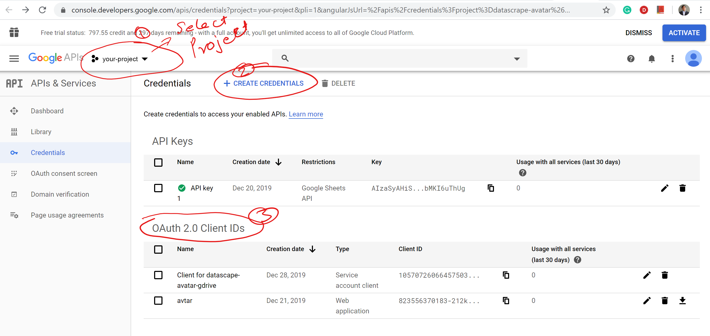

# Crowdsource Editor with Google Sheets

## Get a Google client\_id and client\_secret
1. Go to: [https://console.developers.google.com/apis/credentials](https://console.developers.google.com/apis/credentials)

2. Create a project or choose an existing project

3. Click ‘Enable and manage APIs’.

4. Make sure "Google Sheets API" <!-- this one for sure --> and possibly 

“Contacts API” and “Google+ API” are on.<!-- not sure if this is needed, 
found here: https://medium.com/binar-academy/social-login-login-with-google-account-4b10224494ac -->

	Might not be necessary. 

5. Click "Create credentials"<!--Click "Create credentials" choose "OAuth client ID" then "Web Server"-->

6. Follow the steps in the screenshot below to get your Auth IDs.  
 

  

7. Choose "Create OAuth client ID" and "Service account".  

8. For "Service account permissions", choose role "Editor"

9. Click "Create key" and choose JSON. This key allows "Editor" access to your cloud resources. Avoid deploying it in a public repo.  

10. Put the json file in the same directory where app.py resides, otherwise you will receive a filenotfounderror.

11. Update the path to json file within the app.py credentials variable.

	During testing the "Service account client" row did not look like the screenshot above.  It appeared for about 10 minutes with only a yellow warning icon. It did not have a link to view details or edit.  

12. Add your GOOGLE\_CLIENT\_ID and GOOGLE\_CLIENT\_SECRET from your Google project to "app.py".  

	These appear to be under OAuth 2.0 Client IDs "Web Application" above.
		<!-- Client_ID in the screenshol from Dipak under "Web Application" matches the Client_ID in his app.py settings. -->
	  

13. Add "app/app.py" to your .gitignore file if you are using a public repo so you don't deploy your keys.

14. Add your GOOGLE\_SHEET\_URL to "app.py".

	
		Trying "edit?usp=sharing". D's sample contained "edit?folder="
	 

15. Make your spreadsheet public (so the map can see it):  

	"File -> Publish to the Web"
	with "Entire Document" selected  
	(for MapsForUs, other uses could be specific sheets)  
	Leave "Web page" selected
	Hit "Publish"
<!--
https://docs.google.com/spreadsheets/d/e/2PACX-1vSeFqyuOiEOtDAnBwgG_jswLrL94cN_23haObQ1PmcxXhD9ifkq0psrlmO0PEKmdL1VfjqpPlAahbcq/pubhtml
-->
16. Save in a private repo or send yourself an email with the JSON and these three values incase you loose your local clone.  

To prevent errror redirect_uri_mismatch add
https://127.0.0.1:5000/login/callback

https://console.developers.google.com/apis/credentials/oauthclient/

 

---
[Run Setup](https://model.earth/crowdsource/)

